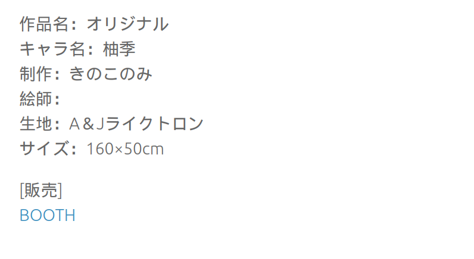
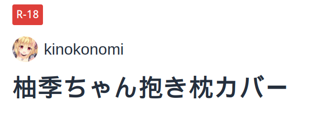
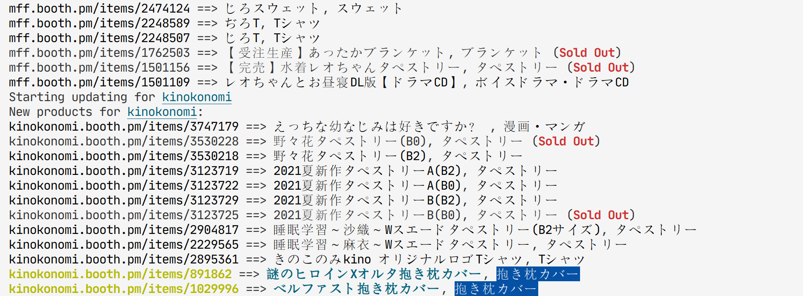

# Simple-Booth-Notifier


这次用中文（大雾）

For all those who could understand the title and brief of this project, they should know what `booth` means in this context(https://booth.pm). The project target is more personal than general in that it only focuses on `dakimakura` which is *written fixed into the program* as a static class-variable. All of the elaboration below is presented in `zh-CN` and I think this paragraph is enough self-explainable.

## 目标

获取你关注的画师，商店中所有的物品。这个过程以我程序的**增量式更新**为准，每次在控制台中输出的更新信息，都是距离上次你运行这个程序之后，关注的商店中**新增**的东西。所有**抱枕**（抱き枕カバー, pillow-case cover）类的商品，在**未售完**的情况下，会以非常显眼的字符串形式出现。

## <div id="getSubscription">怎么获取关注？</div>

首先，通过某种手段确认你想寻找的画师，他确实在booth上卖东西。比如，抱枕相关资源站`omiai-dakimakura.com`中会有你想寻找的booth的链接。



点进去后是商品页，如果商品还在（可能有r18确认），那就有画师的信息（如果没有，booth会自己跳到那个画师的主页上，结果上看一样）。



点到画师的头像或者名字就可以去到他的主页上了。你需要的信息只有这个（在这个例子中是`kinokonomi`）：


这是浏览器上方导航栏中显示的地址。在下方[添加关注列表](#addSubscription)的时候，我们只需要这个url中`https://`及`.booth.pm`中间的那部分。

## 运行时截图



## 程序拓展相关

尽管为了方便起见，我没有写入更多的用户交互接口，但还是可以通过较为简单的设置，获取一些必要且有用的程序拓展功能。

1. 添加商品类型

   你可以修改`GoodsDTO.py`中的`FAVORED_TYPES`添加你想要关注的商品类型（**日文**，这些商品类型可以通过浏览器访问booth站的商品得到，可能需要日本的VPN）。添加的示例见下。

   源文件：

   ` FAVORED_TYPES = ["抱き枕カバー", ]`

   参考的修改格式：

   ` FAVORED_TYPES = ["抱き枕カバー", "タペストリー"]`

   （タペストリー是tapestry，挂画的意思）

   或者按照上面的格式，添加或删除更多你想自定义的标签。

2. <div id="addSubscription">添加关注列表</div>

   你需要手动修改`history.json`中的一些信息。这个文件记录了你关注的所有画师的信息。

   你可能需要粗略了解一下`json`文件的语法。

   最简便的方法是，拷贝一个`users`键值对中的一个画师信息：

   ```json
   "amenochiyuki": {
               "goods": [
                   "3656090",
                   "3654053",
                   "3655898",
                   "3655928",
                   "3655873",
                   "2664093",
                   "2390610"
               ],
               "timestamp": "2022-04-04 22:13:16"
           }
   ```

   粘贴到下面去之后，清空`goods`键中的所有字符串，留下一个空列表（`timestamp`可以不动），然后将画师的名字（这个例子中是`amenochiyuki`，あめとゆき，雨夹雪的id），改成你想关注的画师的id（下面例子中是`mff`，まふゆ的id，获取id的方式[见上](#getSubscription)）。

   ```json
   "mff": {
               "goods": [
               ],
               "timestamp": "2022-04-04 22:13:16"
           }
   ```

3. 泛用性相关

- 不适用的情况

    由于只能寻找`Booth`上的商品，像`Getchu`, `Mandarake`等等的通贩网站，是不能查找到的。

    有些画师，像是`九条だんぼ`等，在booth上虽然是有自己的主页，但是并不售卖任何我们感兴趣的商品，相对地，
    他们更多地是将自己的商品代理给第三方。然而，由于我们并不对第三方的所有商品感兴趣，这些情况下简单地将
    第三方商店的名称添加到`history.json`中并不能解决所有问题。

- 强调
  
    因此，关注画师的最好方式，是**多维度**的，对于已经有兴趣的画师，个人的参考关注路径如下：

    - 上`omiai-dakimakura`，首先确认该画师有没有我们感兴趣的类型的商品。~~（上这个网站就是抱枕了x）~~
​	
    - 网站会给出画师的相关商品主页，跟着这条线索，可以找出画师主要活跃的网站（可能70%会是`Twitter`），然后只要定期去查看那个网站就好了。在我这个思路中，这个网站就是`Booth`。
